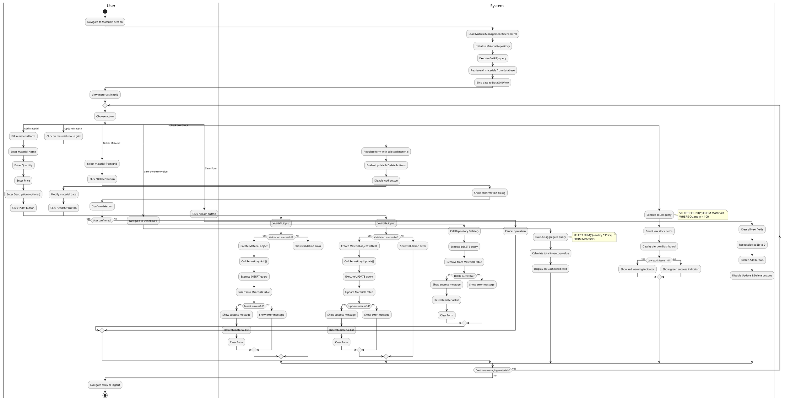

# WareHouse Application - Activity Diagram (Material Management Flow)

## Description

This activity diagram illustrates the complete workflow for Material Management in the WareHouse Application, including all CRUD operations and inventory analytics.

## Main Activities

### 1. Initial Load
- System loads the MaterialManagement UserControl
- Initializes MaterialRepository
- Retrieves all materials from database
- Displays in DataGridView

### 2. Add Material Flow
**User Actions:**
- Fill material form (Name, Quantity, Price, Description)
- Click "Add" button

**System Actions:**
- Validate inputs (required fields, numeric validation)
- Create Material object
- Execute INSERT SQL query
- Show success/error message
- Refresh material list
- Clear form

**Validation Rules:**
- Material Name: Required, not empty
- Quantity: Required, must be positive integer
- Price: Required, must be positive decimal
- Description: Optional

### 3. Update Material Flow
**User Actions:**
- Select material from grid (click row)
- Modify data in form
- Click "Update" button

**System Actions:**
- Populate form with selected material data
- Enable Update/Delete buttons, disable Add
- Validate modified inputs
- Execute UPDATE SQL query
- Show success/error message
- Refresh list and clear form

### 4. Delete Material Flow
**User Actions:**
- Select material from grid
- Click "Delete" button
- Confirm deletion in dialog

**System Actions:**
- Show confirmation dialog
- If confirmed, execute DELETE SQL query
- Show success/error message
- Refresh list and clear form

### 5. View Inventory Value
**System Actions:**
- Execute aggregate SQL query: `SUM(Quantity * Price)`
- Calculate total value of all materials
- Display on Dashboard in styled card
- Show average value per item

### 6. Check Low Stock
**System Actions:**
- Execute count query for items with Quantity < 100
- Display count on Dashboard
- Show visual indicators:
  - **Red alert** if low stock items exist
  - **Green checkmark** if all items well-stocked
- Display threshold information

### 7. Clear Form
**User Actions:**
- Click "Clear" button

**System Actions:**
- Clear all input fields
- Reset internal state
- Enable Add, disable Update/Delete

## Decision Points

1. **Validation Success?**
   - Yes → Proceed with database operation
   - No → Show validation error, stay on form

2. **Database Operation Success?**
   - Yes → Show success message, refresh data
   - No → Show error message (exception details)

3. **User Confirmed Deletion?**
   - Yes → Execute DELETE query
   - No → Cancel operation, no changes

4. **Low Stock Items Exist?**
   - Yes → Red warning indicator
   - No → Green success indicator

5. **Continue Managing Materials?**
   - Yes → Return to action selection
   - No → Navigate away or logout

## Parallel Activities

The split sections indicate that these operations are independent choices the user can make at any time:
- Add new material
- Update existing material
- Delete material
- View inventory analytics
- Clear form

## Error Handling

All database operations are wrapped in try-catch blocks:
- Connection errors
- SQL syntax errors
- Constraint violations
- Timeout errors

Errors are caught and displayed to the user with appropriate messages.

## Notes

- Same pattern applies to Customer and Employee management
- Low stock threshold is configurable (currently 100 units)
- Inventory calculations include all materials in real-time
- All operations require admin authentication

