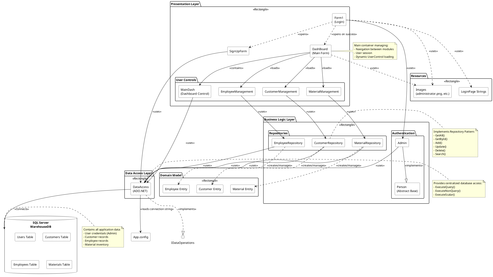

# WareHouse Application - Component Diagram



## Description

This component diagram shows the high-level architecture of the WareHouse Application organized into distinct layers and components.

## Architecture Layers

### 1. Presentation Layer (UI)
**Components:**
- **Form1 (Login)**: Entry point for user authentication
- **SignUpForm**: New user registration
- **DashBoard**: Main application shell/container
- **User Controls**:
  - MainDash: Dashboard with statistics and analytics
  - CustomerManagement: Customer CRUD interface
  - EmployeeManagement: Employee CRUD interface
  - MaterialManagement: Material/Inventory CRUD interface

**Responsibilities:**
- User input validation
- Display data to users
- Handle user interactions
- Navigation between modules

### 2. Business Logic Layer
**Components:**
- **Authentication Package**:
  - Person (Abstract): Defines authentication contract
  - Admin: Implements authentication logic
  
- **Repositories Package**:
  - CustomerRepository: Customer data operations
  - EmployeeRepository: Employee data operations
  - MaterialRepository: Material data operations

**Responsibilities:**
- Business rules and validation
- Authentication and authorization
- Coordinate between UI and data layers
- Implement Repository Pattern

### 3. Data Access Layer
**Components:**
- **DataAccess**: Centralized ADO.NET wrapper

**Responsibilities:**
- Execute SQL queries
- Manage database connections
- Convert between DataTable and objects
- Read connection strings from configuration

### 4. Domain Model (Entities)
**Components:**
- Customer Entity
- Employee Entity
- Material Entity

**Responsibilities:**
- Define data structures
- Represent database tables as objects
- Provide strongly-typed data models

### 5. External Systems & Resources
**Components:**
- **SQL Server Database (WarehouseDB)**:
  - Users table
  - Customers table
  - Employees table
  - Materials table
  
- **Configuration**:
  - App.config (connection strings)
  
- **Resources**:
  - Images (UI icons and graphics)
  - String resources (internationalization)

## Component Relationships

### Key Dependencies:
1. **UI → Business Logic**: Forms use repositories and authentication
2. **Business Logic → Data Access**: All repositories depend on DataAccess
3. **Data Access → Database**: DataAccess connects to SQL Server
4. **Business Logic → Domain Model**: Repositories create/manage entities
5. **UI ↔ UI**: Navigation between forms/controls

## Design Patterns Implemented

1. **Layered Architecture**: Clear separation of concerns
2. **Repository Pattern**: Abstracts data access logic
3. **Singleton-like**: DataAccess manages single connection string
4. **Factory Pattern**: Repositories create entity instances
5. **Abstract Factory**: Person abstract class
6. **MVC/MVP**: Separation of presentation and business logic
7. **Dependency Injection-like**: Repositories injected into UI controls

## Data Flow

```
User Input → Presentation Layer → Business Logic Layer → Data Access Layer → Database
                                                                              ↓
User Display ← Presentation Layer ← Business Logic Layer ← Data Access Layer ←
```

## Technology Stack

- **UI Framework**: Windows Forms (WinForms)
- **Language**: C# (.NET Framework)
- **Data Access**: ADO.NET
- **Database**: SQL Server (LocalDB/Express)
- **Configuration**: App.config (XML)
- **Design**: Repository Pattern, Layered Architecture

