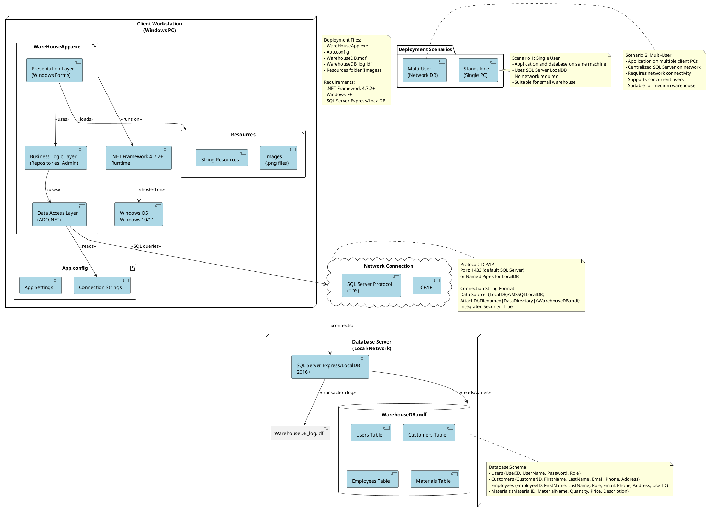

# WareHouse Application - Deployment Diagram



## Description

This deployment diagram shows how the WareHouse Application is deployed across physical and logical nodes in the infrastructure.

## Deployment Nodes

### 1. Client Workstation (Windows PC)
**Hardware Requirements:**
- Operating System: Windows 7 or later (Windows 10/11 recommended)
- Processor: Intel Core i3 or equivalent
- RAM: 4 GB minimum (8 GB recommended)
- Storage: 500 MB free space
- Display: 1024x768 minimum resolution

**Software Components:**
- **.NET Framework 4.7.2+**: Runtime environment for the application
- **WareHouseApp.exe**: Main application executable containing:
  - Presentation Layer (Windows Forms UI)
  - Business Logic Layer (Repositories, Authentication)
  - Data Access Layer (ADO.NET)
- **App.config**: Configuration file with connection strings
- **Resources Folder**: UI assets (images, icons)

### 2. Database Server
**Deployment Options:**

#### Option A: LocalDB (Standalone)
- **SQL Server LocalDB**: Lightweight database engine
- Runs on the same machine as the application
- Suitable for single-user scenarios
- Database files: `WarehouseDB.mdf`, `WarehouseDB_log.ldf`

#### Option B: SQL Server Express (Network)
- **SQL Server Express**: Free database server
- Can be installed on dedicated server or workstation
- Supports multiple concurrent connections
- Suitable for multi-user scenarios

**Database Components:**
- **WarehouseDB.mdf**: Main database file
- **WarehouseDB_log.ldf**: Transaction log file
- **Tables**: Users, Customers, Employees, Materials

## Communication

### Network Protocol
- **Protocol**: TCP/IP
- **Port**: 1433 (default SQL Server port)
- **Alternative**: Named Pipes for LocalDB
- **Data Protocol**: TDS (Tabular Data Stream) - SQL Server native protocol

### Connection String Examples

**LocalDB (Standalone):**
```
Data Source=(LocalDB)\MSSQLLocalDB;
AttachDbFilename=|DataDirectory|\WarehouseDB.mdf;
Integrated Security=True;
Connect Timeout=30
```

**SQL Server Express (Network):**
```
Data Source=SERVER_NAME\SQLEXPRESS;
Initial Catalog=WarehouseDB;
Integrated Security=True;
```

**SQL Server with Authentication:**
```
Data Source=SERVER_NAME;
Initial Catalog=WarehouseDB;
User ID=warehouseapp;
Password=********;
```

## Deployment Scenarios

### Scenario 1: Standalone Deployment
**Use Case**: Small warehouse, single administrator

**Architecture:**
- Single Windows PC
- Application and database on same machine
- SQL Server LocalDB
- No network required

**Advantages:**
- Simple installation
- No network configuration
- Lower cost
- Fast performance (local access)

**Disadvantages:**
- Single user only
- No remote access
- No data centralization

### Scenario 2: Multi-User Network Deployment
**Use Case**: Medium warehouse, multiple administrators

**Architecture:**
- Multiple client workstations
- Centralized SQL Server on network server
- LAN/WAN connectivity
- Shared database

**Advantages:**
- Multiple concurrent users
- Centralized data management
- Remote access possible
- Better backup/recovery options

**Disadvantages:**
- Network dependency
- More complex setup
- Requires server infrastructure
- Network performance considerations

### Scenario 3: Hybrid Deployment
**Use Case**: Multiple locations with occasional synchronization

**Architecture:**
- LocalDB on each location
- Periodic data sync (manual or scheduled)
- Export/Import functionality

## Installation Steps

### 1. Prerequisites
```
✓ Windows 7 or later
✓ .NET Framework 4.7.2 or later
✓ SQL Server Express/LocalDB
✓ Administrator privileges (for first run)
```

### 2. Application Installation
1. Copy application files to target directory:
   - WareHouseApp.exe
   - App.config
   - Resources folder
   - WarehouseDB.mdf
   - WarehouseDB_log.ldf

2. Update App.config with correct connection string

3. Run database.sql script to initialize schema (if using SQL Server)

4. Create desktop shortcut for WareHouseApp.exe

5. Launch application and test login

### 3. Database Setup

**For LocalDB:**
- Database files automatically attached on first run
- No additional configuration needed

**For SQL Server:**
1. Create database: `CREATE DATABASE WarehouseDB`
2. Run schema script: `database.sql`
3. Configure user permissions
4. Update connection string in App.config

## Security Considerations

### Network Security
- Use Windows Authentication when possible
- Encrypt SQL Server connections (SSL/TLS)
- Configure firewall rules (port 1433)
- Restrict database access to authorized IPs

### Application Security
- Store connection strings securely (encrypt App.config)
- Implement proper user authentication
- Use parameterized queries (already implemented)
- Regular security updates for .NET Framework and SQL Server

### Data Security
- Regular database backups
- Implement transaction log backups
- Use SQL Server encryption features
- Restrict physical access to server

## Scalability

### Current Limitations
- Windows Forms UI (client-side only)
- Direct database connections (no middle tier)
- No built-in load balancing

### Future Enhancements
- Web-based interface (ASP.NET)
- REST API middle tier
- Cloud database (Azure SQL)
- Mobile applications
- Microservices architecture

## Monitoring & Maintenance

### Application Monitoring
- Windows Event Viewer logs
- Application-level error logging
- Performance counters

### Database Monitoring
- SQL Server Profiler
- Database activity monitoring
- Query performance analysis
- Backup verification

### Maintenance Tasks
- Regular database backups (daily recommended)
- Index optimization (weekly)
- Database integrity checks (weekly)
- Application updates and patches
- Log file cleanup

