# WareHouse Application - Sequence Diagram (Customer CRUD Operations)

```plantuml
@startuml WareHouseApp_CustomerCRUD

skinparam sequenceMessageAlign center
skinparam responseMessageBelowArrow true

actor "Admin User" as User
participant "CustomerManagement\n(UserControl)" as CustomerMgmt
participant "CustomerRepository" as Repository
participant "DataAccess" as DataAccess
database "SQL Server\n(WarehouseDB)" as Database

== Load All Customers ==
autonumber
User -> CustomerMgmt: Navigate to Customers
activate CustomerMgmt

CustomerMgmt -> Repository: GetAll()
activate Repository

Repository -> DataAccess: ExecuteQuery("SELECT * FROM Customers")
activate DataAccess

DataAccess -> Database: Execute SELECT query
activate Database
Database --> DataAccess: Return DataTable
deactivate Database

DataAccess --> Repository: Return DataTable
deactivate DataAccess

Repository -> Repository: Map DataTable to List<Customer>
Repository --> CustomerMgmt: Return IEnumerable<Customer>
deactivate Repository

CustomerMgmt -> CustomerMgmt: Bind to DataGridView
CustomerMgmt --> User: Display customers in grid
deactivate CustomerMgmt

== Add New Customer ==
autonumber
User -> CustomerMgmt: Fill form & click "Add"
activate CustomerMgmt

CustomerMgmt -> CustomerMgmt: ValidateInput()
note right
  - Check FirstName not empty
  - Check LastName not empty
end note

alt Validation Failed
    CustomerMgmt -> User: Show validation error
    deactivate CustomerMgmt
else Validation Passed
    CustomerMgmt -> Repository: Add(customer)
    activate Repository
    
    Repository -> DataAccess: ExecuteNonQuery(sql, parameters)
    activate DataAccess
    note right
      INSERT INTO Customers 
      (FirstName, LastName, Email, Phone, Address)
      VALUES (@fname, @lname, @email, @phone, @address)
    end note
    
    DataAccess -> Database: Execute INSERT
    activate Database
    Database --> DataAccess: Return rows affected
    deactivate Database
    
    DataAccess --> Repository: Return int
    deactivate DataAccess
    
    Repository --> CustomerMgmt: Return (void)
    deactivate Repository
    
    CustomerMgmt -> User: Show "Customer added successfully!"
    CustomerMgmt -> CustomerMgmt: LoadCustomers()
    CustomerMgmt -> CustomerMgmt: ClearForm()
    deactivate CustomerMgmt
end

== Update Customer ==
autonumber
User -> CustomerMgmt: Select customer from grid
activate CustomerMgmt
CustomerMgmt -> CustomerMgmt: dgvCustomers_CellClick()
CustomerMgmt -> CustomerMgmt: Populate form fields
CustomerMgmt -> CustomerMgmt: Enable Update & Delete buttons
CustomerMgmt --> User: Display customer data in form
deactivate CustomerMgmt

User -> CustomerMgmt: Modify data & click "Update"
activate CustomerMgmt

CustomerMgmt -> CustomerMgmt: ValidateInput()

alt Validation Failed
    CustomerMgmt -> User: Show validation error
    deactivate CustomerMgmt
else Validation Passed
    CustomerMgmt -> Repository: Update(customer)
    activate Repository
    
    Repository -> DataAccess: ExecuteNonQuery(sql, parameters)
    activate DataAccess
    note right
      UPDATE Customers SET 
      FirstName=@fname, LastName=@lname,
      Email=@email, Phone=@phone, Address=@address
      WHERE CustomerID=@id
    end note
    
    DataAccess -> Database: Execute UPDATE
    activate Database
    Database --> DataAccess: Return rows affected
    deactivate Database
    
    DataAccess --> Repository: Return int
    deactivate DataAccess
    
    Repository --> CustomerMgmt: Return (void)
    deactivate Repository
    
    CustomerMgmt -> User: Show "Customer updated successfully!"
    CustomerMgmt -> CustomerMgmt: LoadCustomers()
    CustomerMgmt -> CustomerMgmt: ClearForm()
    deactivate CustomerMgmt
end

== Delete Customer ==
autonumber
User -> CustomerMgmt: Select customer & click "Delete"
activate CustomerMgmt

CustomerMgmt -> User: Show confirmation dialog
User -> CustomerMgmt: Confirm deletion

alt User Cancelled
    CustomerMgmt --> User: No action taken
    deactivate CustomerMgmt
else User Confirmed
    CustomerMgmt -> Repository: Delete(customerId)
    activate Repository
    
    Repository -> DataAccess: ExecuteNonQuery(sql, parameters)
    activate DataAccess
    note right
      DELETE FROM Customers 
      WHERE CustomerID = @id
    end note
    
    DataAccess -> Database: Execute DELETE
    activate Database
    Database --> DataAccess: Return rows affected
    deactivate Database
    
    DataAccess --> Repository: Return int
    deactivate DataAccess
    
    Repository --> CustomerMgmt: Return (void)
    deactivate Repository
    
    CustomerMgmt -> User: Show "Customer deleted successfully!"
    CustomerMgmt -> CustomerMgmt: LoadCustomers()
    CustomerMgmt -> CustomerMgmt: ClearForm()
    deactivate CustomerMgmt
end

== Search Customer ==
autonumber
User -> CustomerMgmt: Enter search text & click "Search"
activate CustomerMgmt

CustomerMgmt -> Repository: Search(searchText)
activate Repository

Repository -> DataAccess: ExecuteQuery(sql, parameters)
activate DataAccess
note right
  SELECT * FROM Customers 
  WHERE FirstName LIKE @search 
  OR LastName LIKE @search 
  OR Email LIKE @search
end note

DataAccess -> Database: Execute SELECT with LIKE
activate Database
Database --> DataAccess: Return filtered DataTable
deactivate Database

DataAccess --> Repository: Return DataTable
deactivate DataAccess

Repository -> Repository: Map DataTable to List<Customer>
Repository --> CustomerMgmt: Return IEnumerable<Customer>
deactivate Repository

CustomerMgmt -> CustomerMgmt: Bind to DataGridView
CustomerMgmt --> User: Display filtered customers
deactivate CustomerMgmt

@enduml
```

## Description

This sequence diagram illustrates all CRUD (Create, Read, Update, Delete) operations for Customer Management, which follows the same pattern for Employee and Material management.

### Operations Covered:

#### 1. Load All Customers (READ)
- Retrieves all customer records from database
- Maps database results to Customer objects
- Displays in DataGridView

#### 2. Add Customer (CREATE)
- Validates user input (FirstName, LastName required)
- Inserts new record into database
- Refreshes the customer list
- Clears the form

#### 3. Update Customer (UPDATE)
- User selects customer from grid
- Form populates with selected data
- User modifies and clicks Update
- Validates input
- Updates database record
- Refreshes list and clears form

#### 4. Delete Customer (DELETE)
- User selects customer and clicks Delete
- System shows confirmation dialog
- Upon confirmation, deletes from database
- Refreshes list and clears form

#### 5. Search Customer
- User enters search text
- System queries database with LIKE operator
- Searches across FirstName, LastName, and Email
- Displays filtered results

### Design Patterns Used:
1. **Repository Pattern**: CustomerRepository abstracts data access
2. **Data Mapper**: Maps DataTable rows to Customer objects
3. **DTO Pattern**: Customer class serves as Data Transfer Object
4. **Layered Architecture**: UI → Repository → DataAccess → Database

### Common Flow:
All operations follow the pattern:
**UI → Repository → DataAccess → Database → DataAccess → Repository → UI**

This same pattern applies to Employee and Material management with their respective entities.

