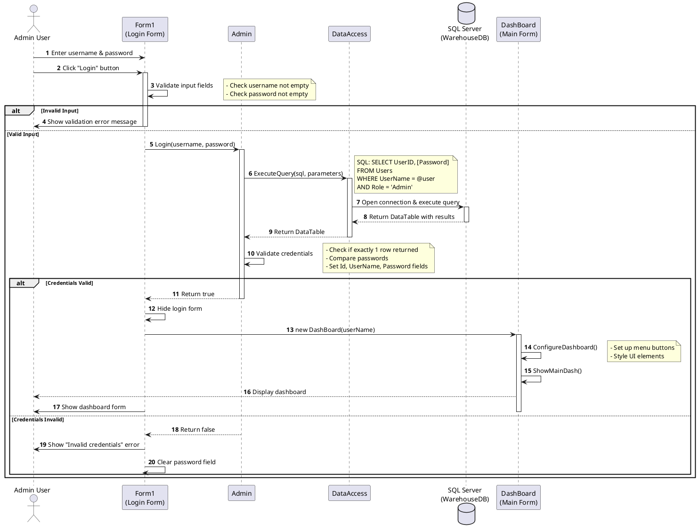

# WareHouse Application - Sequence Diagram (Login Flow)

## Description

This sequence diagram illustrates the complete login authentication flow in the WareHouse Application.

### Key Steps:

1. **User Input**: Admin enters username and password
2. **Validation**: Form1 validates input fields are not empty
3. **Authentication**: 
   - Admin object queries database through DataAccess
   - SQL query filters by username and 'Admin' role
   - Returns user record if exists
4. **Credential Verification**:
   - Checks exactly one matching record exists
   - Compares plain text passwords (note: not hashed in current implementation)
5. **Success Path**:
   - Login form hides itself
   - Creates and displays DashBoard form
   - Dashboard initializes with user's name
   - Shows main dashboard with statistics
6. **Failure Path**:
   - Returns error message to user
   - Clears password field for retry

### Design Patterns Observed:
- **Layered Architecture**: UI → Business Logic → Data Access → Database
- **Separation of Concerns**: Each layer has distinct responsibility
- **Error Handling**: Try-catch blocks at UI layer for exception handling

### Security Note:
The current implementation stores and compares plain text passwords. In a production system, this should use proper password hashing (bcrypt, PBKDF2, etc.).

