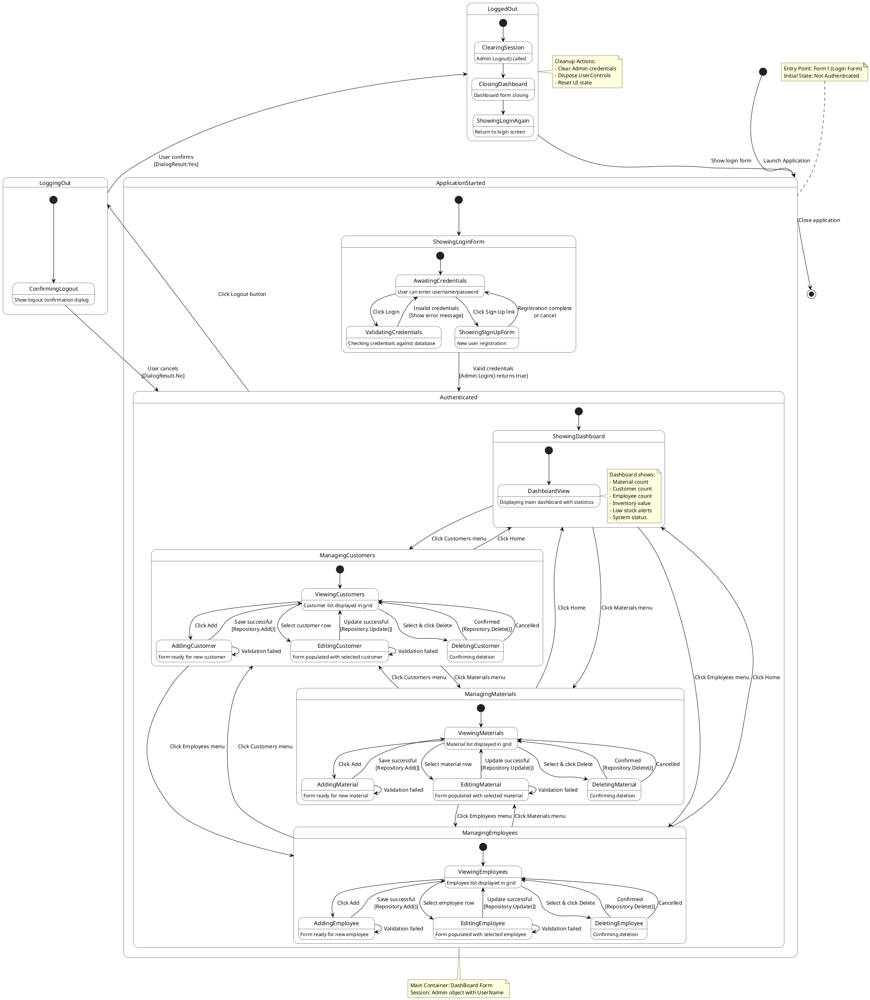

# WareHouse Application - State Diagram (User Session)



## Description

This state diagram models the complete user session lifecycle in the WareHouse Application, from application launch through authentication, various management activities, and logout.

## Major States

### 1. Application Started
**Entry State**: Application launch
- Displays Form1 (Login Form)
- User can enter credentials
- Option to navigate to Sign Up form

**Substates:**
- **AwaitingCredentials**: Idle, waiting for user input
- **ValidatingCredentials**: Checking credentials via Admin.Login()
- **ShowingSignUpForm**: New user registration dialog

**Transitions:**
- Invalid credentials → Return to AwaitingCredentials with error message
- Valid credentials → Transition to Authenticated state
- Sign Up link → Open SignUpForm modal dialog

### 2. Authenticated
**Entry Condition**: Successful login (Admin.Login() returns true)
**Session Info**: Admin object stores UserID, UserName
**Container**: DashBoard Form

This is a composite state with multiple substates:

#### 2.1 Showing Dashboard
**Default View**: Main dashboard with analytics
- Displays statistics (counts, inventory value)
- Shows low stock alerts
- System status information
- Entry point after successful login

#### 2.2 Managing Customers
**CRUD Operations State Machine:**
- **ViewingCustomers**: List displayed in DataGridView
- **AddingCustomer**: Empty form, Add button enabled
  - Success → Return to ViewingCustomers with refreshed data
  - Validation failure → Stay in AddingCustomer, show error
- **EditingCustomer**: Form populated with selected data
  - Success → Return to ViewingCustomers
  - Validation failure → Stay in EditingCustomer
- **DeletingCustomer**: Confirmation dialog displayed
  - Confirmed → Delete record, return to ViewingCustomers
  - Cancelled → Return to ViewingCustomers

#### 2.3 Managing Employees
**Identical structure to ManagingCustomers:**
- ViewingEmployees
- AddingEmployee (with validation loop)
- EditingEmployee (with validation loop)
- DeletingEmployee (with confirmation)

#### 2.4 Managing Materials
**Identical structure to ManagingCustomers:**
- ViewingMaterials
- AddingMaterial (with validation loop)
- EditingMaterial (with validation loop)
- DeletingMaterial (with confirmation)

**Inter-Navigation**: User can switch between any management module or return to dashboard via menu buttons.

### 3. Logging Out
**Trigger**: User clicks Logout button
**Substate**: ConfirmingLogout
- Shows confirmation dialog: "Are you sure you want to logout?"

**Transitions:**
- DialogResult.Yes → Proceed to LoggedOut state
- DialogResult.No → Return to current Authenticated substate

### 4. Logged Out
**Cleanup State**: Prepares for next session

**Substates:**
1. **ClearingSession**: 
   - Call Admin.Logout()
   - Clear UserID, UserName, Password fields
   - Set Id = 0

2. **ClosingDashboard**: 
   - Dispose current UserControl
   - Close DashBoard form

3. **ShowingLoginAgain**: 
   - Create new Form1 instance
   - Show login screen
   - Return to ApplicationStarted state

## State Invariants

### While in ApplicationStarted
- No user session exists
- No admin object initialized with credentials
- Only Form1 visible

### While in Authenticated
- Valid Admin object with UserID > 0
- UserName stored in session
- DashBoard form visible
- At least one child control (Dashboard or Management) active

### While in Management States (Customers/Employees/Materials)
- Repository object initialized
- DataGridView populated with current data
- Form controls enabled/disabled based on selection state

### While in Editing/Deleting States
- _selectedId > 0 (valid entity selected)
- Update and Delete buttons enabled
- Add button disabled

### While in Adding States
- _selectedId = 0
- Add button enabled
- Update and Delete buttons disabled

## Guard Conditions

**Login Transition:**
```
[username not empty AND password not empty AND Admin.Login() == true]
```

**Add/Update Transitions:**
```
[ValidateInput() == true AND Repository operation succeeds]
```

**Delete Transition:**
```
[_selectedId > 0 AND User confirms AND Repository.Delete() succeeds]
```

**Logout Transition:**
```
[User confirms in dialog (DialogResult.Yes)]
```

## Actions on Transitions

### On Successful Login:
1. Hide Form1
2. Create DashBoard(userName)
3. Show DashBoard
4. Load MainDash UserControl

### On Navigation (e.g., to Customers):
1. Hide MainDash
2. Create CustomerManagement UserControl
3. Initialize CustomerRepository
4. Load customer data
5. Display in main panel

### On Successful Add/Update/Delete:
1. Execute database operation
2. Show success message
3. Call Load() method (refresh DataGridView)
4. Call ClearForm()
5. Reset button states

### On Logout:
1. Show confirmation dialog
2. If confirmed:
   - Call Admin.Logout()
   - Dispose current UserControl
   - Hide DashBoard
   - Create and show new Form1
   - Close DashBoard

## Error Handling

**Invalid Credentials:**
- Stay in AwaitingCredentials state
- Show error MessageBox
- Clear password field
- Keep username for retry

**Validation Errors:**
- Stay in current Adding/Editing state
- Show validation error MessageBox
- Keep form data intact for correction

**Database Errors:**
- Catch exception in try-catch block
- Show error message with exception details
- Stay in current state
- Do not refresh data (may show outdated data)
- Allow user to retry or navigate away

## Concurrency

**Single User Session:**
- Only one Admin object per application instance
- No concurrent state in user session

**Database Concurrency:**
- Multiple users may access database simultaneously
- No optimistic/pessimistic locking implemented
- Last write wins
- Refresh after operations to get latest data

## Notes

1. **Validation Loops**: Add/Edit states have self-transitions on validation failure, allowing user to correct input without losing data.

2. **Confirmation Required**: Delete operations always require explicit confirmation to prevent accidental data loss.

3. **Session Management**: Admin object maintains session throughout Authenticated state until Logout.

4. **Navigation Flexibility**: User can switch between any management module without logging out.

5. **Clean Transitions**: All state transitions include appropriate cleanup (dispose controls, clear forms, refresh data).

6. **Error Recovery**: Validation and database errors don't crash the application; user stays in recoverable state.

