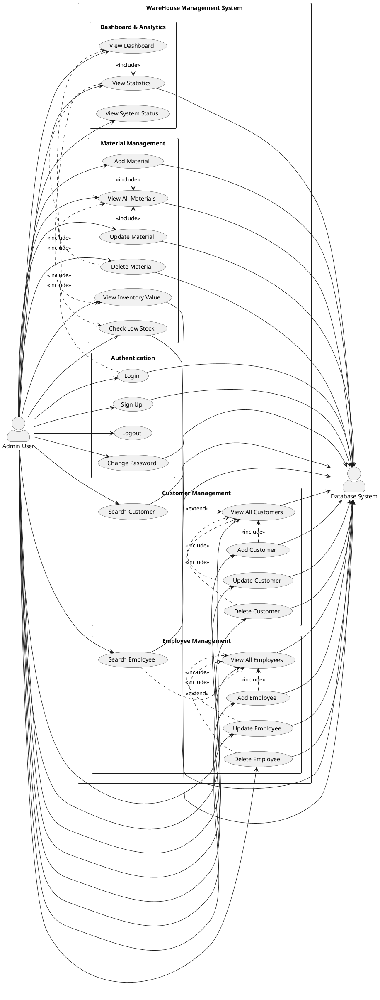

# WareHouse Application - Use Case Diagram

## Description

This use case diagram illustrates all the functional requirements of the WareHouse Management System:

### Actors
1. **Admin User**: The primary user who manages the warehouse system
2. **Database System**: External system storing all data

### Use Case Packages

#### 1. Authentication
- Login to the system
- Sign up for new account
- Logout from the system
- Change password

#### 2. Customer Management
- View all customers in a grid
- Add new customer records
- Update existing customer information
- Delete customer records
- Search for specific customers

#### 3. Employee Management
- View all employees in a grid
- Add new employee records
- Update existing employee information
- Delete employee records
- Search for specific employees

#### 4. Material Management
- View all materials/inventory
- Add new materials
- Update material information (quantity, price)
- Delete materials
- View total inventory value
- Check for low stock items

#### 5. Dashboard & Analytics
- View main dashboard
- View statistics (material count, customer count, employee count)
- View system status and operational information

### Relationships
- **Include**: Mandatory relationships (e.g., Login includes navigating to Dashboard)
- **Extend**: Optional extensions (e.g., Search extends View operations)
- All CRUD operations interact with the Database System

